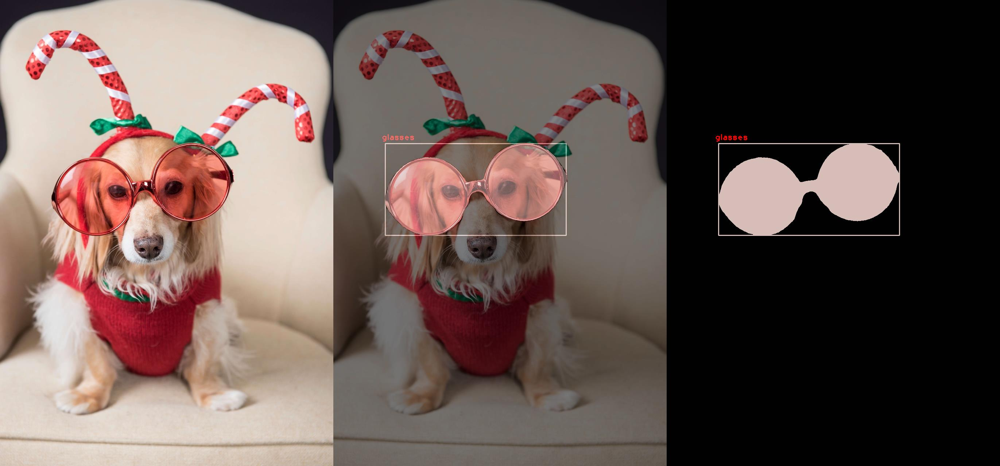
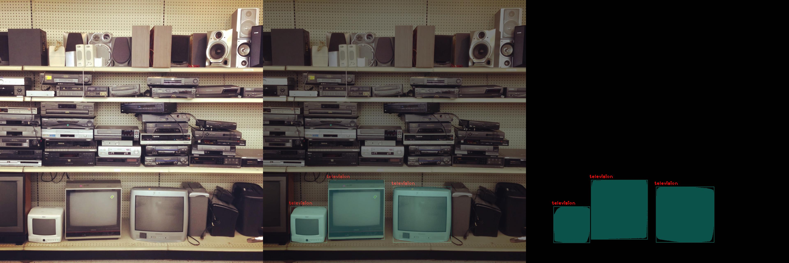

# Segment-Anything-U-Specify
Use SAM and CLIP model to segment unique instances you want.
You may use this repo to segment any instances in the picture with
text prompts.

The main network architecture is as follows:

`Clip Model Architecture`


`SAM Model Architecture`


## Installation

Install python packages via commands:
```
pip3 install -r requirements.txt
```
Download pretrained model weights
```
cd PROJECT_ROOT_DIR
bash scripts/download_pretrained_ckpt.sh
```

## Test Instance Segmentation With Text Prompts
Instance segmentor first using sam model to get all obj's mask of the input image. Second using clip model to classify each mask with both
image features and your text prompts features.

```
cd PROJECT_ROOT_DIR
export PYTHONPATH=$PWD:$PYTHONPATH
python tools/sam_clip_text_seg.py --input_image_path ./data/test_images/test_bear.jpg --text bear --cls_score_thresh 0.998
```

`Bear Instance Segmentation Result, Text Prompt: bear`


`Athelete Instance Segmentation Result, Text Prompt: athlete`


`Horse Instance Segmentation Result, Text Prompt: horse`


`Dog Instance Segmentation Result, Text Prompt: dog`


`Fish Instance Segmentation Result, Text Prompt: fish`


`Strawberry Instance Segmentaton Result, Text Prompt: strawberry`


`Glasses Instance Segmentaton Result, Text Prompt: glasses`


`Tv Instance Segmentaton Result, Text Prompt: television`


`Shoes Instance Segmentaton Result, Text Prompt: shoe`


`Bridge Instance Segmentaton Result, Text Prompt: bridge`


`Airplane Instance Segmentaton Result, Text Prompt: airplane`


### Instance Segmentation Problem
For now the instance segmentation result is sensitive to classification score threshold. And you may get wrong
instance segmentation mask if the background mask contains most of the instance mask you
want.

Most of the background problem has been solved :)
`Befor Optimize`

`After Optimize`


## Test cluster
Cluster first using sam model to get all obj's mask of the input image. Second using clip model to extract image features for each objects. Third calculate feature distance of every two object pairs. Finally using a similarity threshold to cluster source objects.

To test the cluster simply run

```
cd PROJECT_ROOT_DIR
export PYTHONPATH=$PWD:$PYTHONPATH
python tools/cluster_sam.py --input_image_path ./data/test_images/test_bear.jpg --simi_thresh 0.82
```

`Bear Cluster Result`


`Horse Cluster Result`


Each row represents `source image`, `sam origin mask`, `ori masked image`, `clustered mask`, `cluster masked image`

## TODO
- [ ] Test different kinds of cluster method
- [ ] Using cluster result as input prompts to reseg the image via sam model

## Acknowledgement

Most of the repo's code borrows from opeai's clip repo and facebook's segment-anything repo:

- [CLIP](https://github.com/openai/CLIP)
- [segment-anything](https://github.com/facebookresearch/segment-anything)

## Contact

