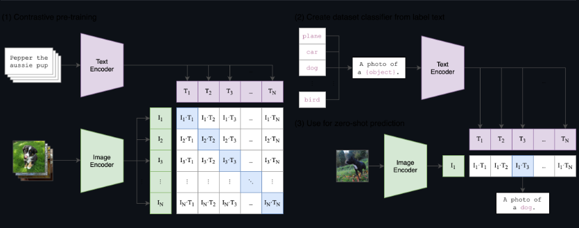

# Segment-Anything-Clip-Cluster
Use clip image encoder to cluster objects from sam segmentation model's result.

The main network architecture is as follows:

`Clip Model Architecture`


`SAM Model Architecture`


## Installation
Install python envs via commands:

```
pip3 install -r requirements.txt
```

## Test cluster
Cluster first using sam model to get all obj's mask of the input image. Second using clip model to extract image features for each objects. Third calculate feature distance of every two object pairs. Finally using a similarity threshold to cluster source objects.

To test the cluster simply run

```
python tools/cluster_sam.py --input_image_path ./data/test_bear.jpg --simi_thresh 0.82
```

`Bear Cluster Result`


`Horse Cluster Result`


Each row represents `source image`, `sam origin mask`, `ori masked image`, `clustered mask`, `cluster masked image`


## TODO
- [] Test different kinds of cluster method
- [] Using cluster result as input prompts to reseg the image via sam model

## Acknowledgement

Most of the repo's code borrows from opeai's clip repo and facebook's segment-anything repo:

- [CLIP](https://github.com/openai/CLIP)
- [segment-anything](https://github.com/facebookresearch/segment-anything)

## Contact

